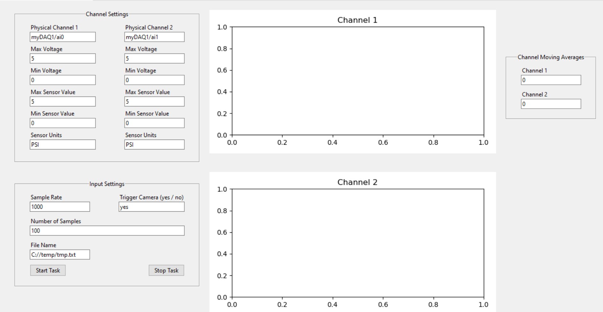

# pydaq
Collection of python scripts to control nidaq cards. 

## Requirements
* NI-DAQmx driver
* nidaqmx python library (pip install nidaqmx)

## Structure

Contained withing scipts/ directory are numerous examples of daq-gui's

Available features include:
* multiple channel inputs
* synchronized analog output (eg: camera trigger)
* data writing -> to text file
* data plotting and averaging

## Use of this repo

* if making small modifications to a script, do so locally and do not push back.
* if adding a new feature (eg: different inputs, types, etc.) create a new script file and push it back.

## Example GUI 

